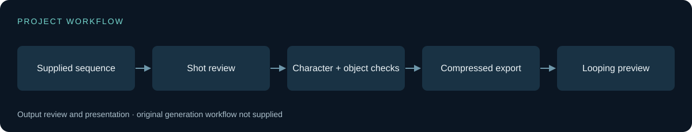

# Seedance — Morning Routine Video

A portrait lifestyle sequence exploring character continuity, everyday actions, and product interaction.

**[Watch the demo](assets/demo.mp4)** · **[Technical approach](docs/architecture.md)** · **[Evaluation](results/metrics.md)** · **[Media notes](docs/media.md)**

Synthetic video output; the animation plays automatically. Model attribution follows the supplied project folder.

## Overview

The supplied sequence follows a morning-routine theme through indoor, breakfast, outdoor, shopping, and mirror shots. It provides a compact visual study of continuity across changing environments and ordinary object interactions.

**Stack:** Seedance / ComfyUI project context · portrait video · lifestyle sequence

## What it does

- Show a complete approximately 30-second portrait sequence.
- Inspect recurring character appearance and transitions across locations.
- Review object handling, reflections, fine text, and visual consistency.

## Results and evidence

| Measured asset property | Value |
| :--- | ---: |
| Source duration | 30.08 s |
| Source resolution | 480 × 854 |
| Source orientation | Portrait |

Measured from the supplied file with FFprobe. No identity-similarity, perceptual-quality, or generation-speed benchmark is available.

## Engineering approach

Character continuity must coexist with changing poses, lighting, reflections, and background context. Fine print and hand/object contact remain useful visual failure checks.

The showcase describes observable results and the supplied Seedance project label. It does not invent a generation recipe or claim identity-preservation accuracy. Product imagery is presented for visual inspection without endorsing its claims.

## Limitations

The supplied folder contains a final video only. Workflow nodes, model revision, prompts, seed, reference images, editing steps, and generation duration cannot be recovered reliably from that output.

## Explore the project

View the preview or [full video](assets/demo.mp4). There is no runnable workflow in the supplied material; model artifacts are intentionally excluded.

## Repository scope

This repository contains curated output media, technical context, and an evaluation plan. The supplied project folder contained no code or workflow graph to publish. Model weights, checkpoints, datasets, secrets, caches, and original Git history are excluded.

Synthetic video case study. The supplied project folder identifies Seedance, but exact generation settings were not available. Depicted brands and products do not imply endorsement.

See [NOTICE](NOTICE) for publication and attribution notes.

